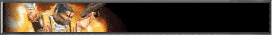

# FortressOne

 

## Getting Started

1. Purchase a copy of Quake
	- [GOG](https://www.gog.com/en/game/quake_the_offering)
	- [Steam](https://store.steampowered.com/app/2310/Quake/)
2. Install FTEQW
	- `git clone https://github.com/fte-team/fteqw.git`
	- `cd fteqw/engine`
	- `make gl-rel -j4`
3. Download FortressOne
	- <https://github.com/FortressOne/fte-config/releases>
	- <https://fortressone.org>
	- <https://drzel.itch.io/fortressone>
	- <https://www.moddb.com/games/fortressone>
	- <https://www.igdb.com/games/fortressone>
	- <https://lutris.net/games/fortressone/>
4. Copy the `id1/` directory with game files, and extract
`FortressOne/fortress` into `fteqw/engine/release`
5. Start playing with `./fteqw-gl -game fortress`
6. Join the [Discord](https://discord.fortressone.org)!
